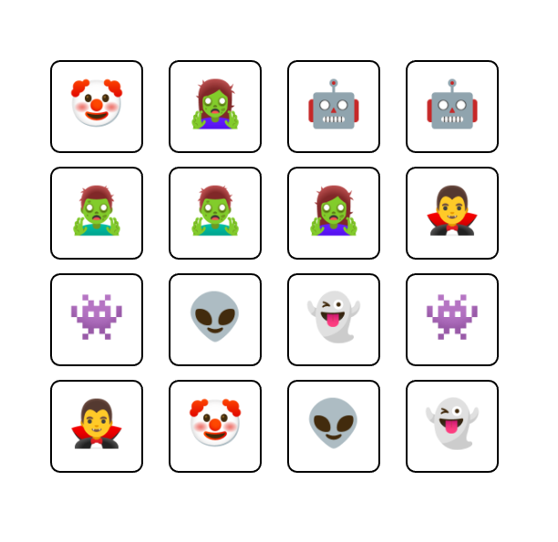

# Memory Game

## Project



### Panduan Pengerjaan

Di dalam folder Memory Game, kalian akan menemukan dua file penting:
1. index.html
2. sketch.js

File index.html digunakan sebagai user interface, kalian bisa membukanya di browser kalian. Ada banyak cara, salah satunya adalah menggunakan extension Live Preview dari Microsoft di VSCode. Setelah melakukan instalasi, maka kalian bisa klik kanan lalu memilih "Show Preview" yang akan membuka file index.html di browser.

File sketch.js digunakan untuk coding, jadi kalian perlu mengetikkan kode yang diperlukan di sini agar game bisa berjalan dengan baik.

### Description

Pada _project_ kali ini kalian diberikan beberapa _function_ dengan penamaan sesuai kegunaannya, yaitu:

1. `setup` : Function utama yang akan **membuat _canvas_ dan memanggil function lainnya** untuk membuat papan permainan.
2. `draw` : Function untuk **menggambar papan permainan** dengan memanggil function `drawTile` untuk setiap _tile_.
3. `createBoard` : Function untuk **membuat papan permainan** dengan memilih secara acak pasangan kartu dari array `cards` dan menempatkannya pada papan.
4. `createTile` : Function untuk **membuat _tile_** dengan posisi dan emoji yang ditentukan.
5. `drawTile` : Function untuk **menggambar _tile_** pada papan permainan.
6. `mouseClicked` : Function yang **dipanggil ketika mouse diklik**, bertugas untuk memeriksa dan membalik _tile_ serta memeriksa apakah ada dua kartu yang telah dibalik.
7. `isUnderMouse` : Function untuk **mengecek apakah _tile_ berada di bawah kursor mouse** atau tidak.
8. `resetUnmatchedTiles` : Function untuk **membalikkan kembali _tile_ yang tidak cocok** setelah dua _tile_ telah dibalik.
9. `checkTiles` : Function untuk **memeriksa _tile_ yang diklik** dan membalikkan _tile_ jika memenuhi kondisi.

Selain itu, terdapat beberapa variabel global seperti `cards`, `NUM_COLS`, `NUM_ROWS`, `board`, `flippedTiles`, dan `twoCardsFlipped` yang digunakan untuk menyimpan data permainan.

Berikut adalah penjelasan untuk setiap variabel:

1. `cards`: Ini adalah array yang berisi delapan string, masing-masing mewakili wajah kartu dalam bentuk emoji. Setiap kartu akan muncul dua kali di papan permainan, sehingga totalnya ada 16 kartu.

    ```js
    let cards = ["🤖", "👾", "👽️", "👻", "🤡", "🧛‍♂️", "🧟‍♂️", "🧟‍♀️"];
    ```

2. `NUM_COLS`: Ini adalah variabel yang menentukan jumlah kolom di papan permainan. Dalam hal ini, papan permainan akan memiliki empat kolom.

    ```js
    let NUM_COLS = 4;
    ```

3. `NUM_ROWS`: Ini adalah variabel yang menentukan jumlah baris di papan permainan. Dalam hal ini, papan permainan akan memiliki empat baris.

    ```js
    let NUM_ROWS = 4;
    ```

4. `board`: Ini adalah array yang akan berisi objek-objek _tile_ yang mewakili papan permainan.

    ```js
    let board = [];
    ```

5. `flippedTiles`: Ini adalah array yang akan berisi _tile_ yang sedang dibalik. Jika ada dua _tile_ dalam array ini, maka perlu dilakukan pengecekan apakah kedua _tile_ tersebut cocok.

    ```js
    let flippedTiles = [];
    ```

6. `twoCardsFlipped`: Ini adalah variabel boolean yang menandai apakah ada dua kartu yang telah dibalik. Jika bernilai `true`, maka perlu dilakukan pengecekan apakah kedua kartu tersebut cocok, dan jika tidak cocok, kedua kartu tersebut perlu dibalik kembali

    ```js
    let twoCardsFlipped = false;
    ```

> NOTE: HARAP DIPERHATIKAN! Gunakan `Math.floor` dan `Math.random` dari JavaScript, sebagai pengganti `floor` atau `random` dari p5js.

#### `setup`

Function `setup` adalah function yang akan dipanggil saat program pertama kali dijalankan. Function ini bertugas untuk melakukan konfigurasi awal program.

Tugas kamu adalah untuk mengimplementasikan function ini dengan melengkapi dan membuat papan permainan dengan memanggil function `createBoard` dan menyimpan hasilnya dalam variabel `board` yang sudah diberikan.

#### `draw`

Function `draw` adalah function yang akan dipanggil secara berulang-ulang setelah `setup` dijalankan. Function ini bertugas untuk menggambar elemen-elemen pada _canvas_ dan melakukan update tampilan.

Tugas kamu adalah untuk mengimplementasikan function ini dengan melengkapi dan melakukan iterasi pada setiap _tile_ dalam papan permainan (_board_) dan memanggil function `drawTile` untuk menggambar setiap _tile_ tersebut.

#### `createBoard`

Function `createBoard` akan digunakan untuk membuat papan permainan yang berisi _tile_. Function ini tidak menerima parameter apapun.

Function ini akan mengembalikan sebuah array `board` yang berisi _tile_. Setiap _tile_ dibuat dengan memanggil function `createTile`.

Kamu juga perlu memastikan bahwa:

-   Panjang array `board` sama dengan `NUM_COLS * NUM_ROWS`.
-   Setiap _tile_ dalam array `board` memiliki properti `x`, `y`, `size`, `face`, `isFaceUp`, dan `isMatch`. Properti `isFaceUp` dan `isMatch` harus bernilai `false`.
-   Setiap emoji dalam array `board` muncul tepat dua kali dengan posisi _random_, yang berarti bahwa setiap _tile_ memiliki pasangannya.

Untuk membantu kamu memahami lebih baik apa yang perlu dilakukan, berikut ini adalah hal yang dapat kamu gunakan sebagai acuan:

-   `createBoard` harus menghasilkan array _tile_ dengan panjang yang tepat.
-   `createBoard` harus menghasilkan _tile_ dengan properti yang benar.
-   `createBoard` harus menghasilkan pasangan emoji pada _tile_ yang sesuai.

#### `createTile`

Function `createTile` digunakan untuk membuat objek _tile_ yang akan digunakan dalam papan permainan. Function ini menerima tiga parameter, yaitu posisi `x`, posisi `y`, dan `face` / emoji.

Berikut ini adalah beberapa hal yang perlu kamu lakukan dalam mengimplementasikan function `createTile`:

1. Function ini harus mengembalikan objek `tile` dengan properti `x`, `y`, `size`, `face`, `isFaceUp`, dan `isMatch`.
2. Nilai properti `x`, `y`, dan `face` ditentukan oleh parameter yang diterima function.
3. Nilai properti `size` **harus** selalu **100**.
4. Nilai properti `isFaceUp` dan `isMatch` diawal bernilai `false`.

Untuk membantu kamu memahami lebih baik apa yang perlu dilakukan, berikut ini adalah hal yang dapat kamu gunakan sebagai acuan:

-   `createTile` harus menghasilkan objek dengan properti yang benar.
-   `createTile` harus menghasilkan objek dengan `size` 100.
-   `createTile` harus menghasilkan objek yang berbeda untuk input yang berbeda.

#### `drawTile`

Function `drawTile` akan digunakan untuk menggambar _tile_ pada papan permainan. Function ini menerima satu parameter, yaitu `tile` yang merupakan objek _tile_ yang akan digambar.

Berikut ini adalah beberapa hal yang perlu kamu lakukan dalam mengimplementasikan function `drawTile`:

1. Menggambar bentuk persegi dengan menggunakan metode `rect`. Koordinat dan ukuran persegi ditentukan oleh properti `x`, `y`, dan `size` dari objek `tile`.
2. Jika _tile_ dalam keadaan terbuka (properti `isFaceUp` bernilai `true`), maka kamu perlu menggambar teks yang merupakan emoji _tile_ (properti `face`) di tengah persegi.

Kamu juga perlu memastikan bahwa:

-   Function `drawTile` dapat menggambar _tile_ dengan benar berdasarkan properti-properti yang dimiliki oleh objek `tile`.
-   Function `drawTile` hanya menggambar emoji _tile_ jika _tile_ dalam keadaan terbuka.

Perlu diperhatikan bahwa kamu mungkin perlu menggunakan beberapa metode dari pustaka p5.js untuk menggambar _tile_, seperti `rect` untuk menggambar persegi dan `text` untuk menggambar emoji pada properti `face` dari _objek_ `tile`.

#### `mouseClicked`

Function `mouseClicked` akan dipanggil saat mouse diklik. Function ini tidak menerima parameter apapun.

Berikut ini adalah beberapa hal yang perlu kamu lakukan dalam mengimplementasikan function `mouseClicked`:

1. Jika dua kartu telah dibalik (variabel `twoCardsFlipped` bernilai `true`), maka kamu perlu memanggil function `resetUnmatchedTiles` untuk membalikkan kembali kartu-kartu yang tidak cocok.
2. Jika tidak, maka kamu perlu memanggil function `checkTiles` untuk memeriksa dan membalikkan kartu yang diklik.
3. Melakukan update nilai dari variable `flippedTiles` dan `twoCardsFlipped` berdasarkan output dari function `resetUnmatchedTiles` dan/atau `checkTiles`.

Kamu juga perlu memastikan bahwa:

-   Function `mouseClicked` dapat membalikkan kembali kartu-kartu yang tidak memiliki emoji yang cocok jika dua kartu telah dibalik.
-   Function `mouseClicked` dapat memeriksa dan membalikkan kartu yang diklik jika kurang dari dua kartu yang telah dibalik.

#### `isUnderMouse`

Function `isUnderMouse` digunakan untuk memeriksa apakah posisi kursor mouse berada di atas _tile_ atau tidak. Function ini menerima tiga parameter, yaitu `tile`, `mouseX`, dan `mouseY`.

Berikut ini adalah beberapa hal yang perlu kamu lakukan dalam mengimplementasikan function `isUnderMouse`:

1. Memeriksa apakah posisi kursor mouse (ditentukan oleh `mouseX` dan `mouseY`) berada di dalam batas _tile_ (ditentukan oleh properti `x`, `y`, dan `size` dari objek `tile`).
2. Function ini akan mengembalikan nilai `true` jika posisi kursor mouse berada di atas _tile_, dan `false` jika tidak.

Untuk membantu kamu memahami lebih baik apa yang perlu dilakukan, berikut ini adalah hal yang dapat kamu gunakan sebagai acuan:

-   `isUnderMouse` harus mengembalikan `true` jika mouse berada di atas _tile_.
-   `isUnderMouse` harus mengembalikan `false` jika mouse tidak berada di atas _tile_.

#### `resetUnmatchedTiles`

Function `resetUnmatchedTiles` digunakan untuk membalikkan kembali semua tile yang tidak cocok setelah dua tile telah dibalik. Function ini menerima satu parameter, yaitu `board` yang merupakan array tile.

Berikut ini adalah beberapa hal yang perlu kamu lakukan dalam mengimplementasikan function `resetUnmatchedTiles`:

1. Melakukan iterasi pada setiap tile dalam array `board`.
2. Jika tile tidak cocok (properti `isMatch` bernilai `false`), maka tile tersebut harus dibalikkan kembali (properti `isFaceUp` diatur menjadi `false`).
3. Mengembalikan objek yang berisi array `flippedTiles` yang kosong dan `twoCardsFlipped` yang bernilai `false`.

Untuk membantu kamu memahami lebih baik apa yang perlu dilakukan, berikut ini adalah hal yang dapat kamu gunakan sebagai acuan:

-   `resetUnmatchedTiles` harus membalikkan kembali semua tile yang tidak cocok (properti `isMatch` bernilai `false`).
-   `resetUnmatchedTiles` tidak boleh mengubah keadaan tile yang cocok (properti `isMatch` bernilai `true`).

#### `checkTiles`

Function `checkTiles` digunakan untuk memeriksa dan membalikkan _tile_ yang diklik. Function ini menerima empat parameter, yaitu:

-   `board` (array _tile_)
-   `flippedTiles` (array _tile_ yang telah dibalik)
-   `mouseX` dan `mouseY` (posisi kursor mouse).

Berikut ini adalah beberapa hal yang perlu kamu lakukan dalam mengimplementasikan function `checkTiles`:

1. Melakukan iterasi pada setiap _tile_ dalam array `board`.
2. Jika _tile_ berada di bawah kursor mouse (dengan memanggil function `isUnderMouse`) dan kurang dari dua _tile_ yang telah dibalik serta _tile_ tersebut belum dibalik (properti `isFaceUp` bernilai `false`), maka _tile_ tersebut perlu dibalik (properti `isFaceUp` diatur menjadi `true`) dan ditambahkan ke dalam array `flippedTiles`.
3. Jika ada dua _tile_ dalam array `flippedTiles`, maka periksa apakah kedua _tile_ tersebut cocok (memiliki emoji yang sama). Jika ya, tandai kedua _tile_ tersebut sebagai cocok (properti `isMatch` diatur menjadi `true`) dan kosongkan array `flippedTiles`. Jika tidak, tandai bahwa ada dua kartu yang telah dibalik (variabel `twoCardsFlipped` diatur menjadi `true`).
4. Mengembalikan objek yang berisi array `flippedTiles` dan `twoCardsFlipped`.

Untuk membantu kamu memahami lebih baik apa yang perlu dilakukan, berikut ini adalah hal yang dapat kamu gunakan sebagai acuan:

-   `checkTiles` harus membalikkan _tile_ yang diklik jika kurang dari dua _tile_ yang telah dibalik.
-   `checkTiles` harus meninggalkan kedua _tile_ yang dibalik dan mengubah properti `isMatch` menjadi `true` jika mereka memiliki emoji yang cocok.
